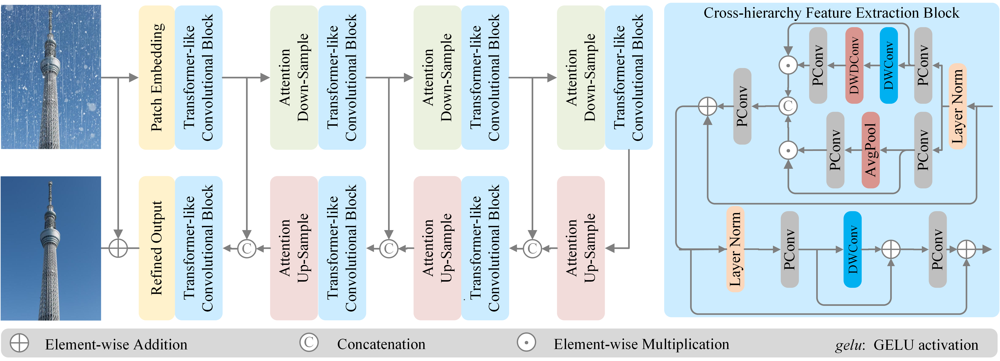

### An Attention-based Sampling Cross-hierarchy Transformer for Rain-by-snow Weather Removal

**Abstract**: Rain-by-snow weather removal stands as a specialized task, aiming to eliminate the concurrent visual distortions caused by both rain streaks and snow particles. To this end, we propose RBSFormer, an attention-based sampling cross-hierarchy Transformer. Through analysis of ConvNets and ViTs, we conclude that these architectures perform comparably in intra-stage learning features. On this basis, we devise a cross-hierarchy feature extraction block (CFEB) that serves as a substitute for the computationally intensive self-attention, while retaining the essential characteristics of adapting to input features. Furthermore, we propose a global-local self-attention sampling mechanism (GLASM) that facilitates the cross-stage progression, ensuring the incorporation of both broad-scale and fine-scale contextual information. Finally, we curate two innovative rain-by-snow datasets, named RSCityScape and RS100K. Extensive experiments verify that RBSFormer achieves the best trade-off between image quality and inference time. Datasets and code are available at \url{https://github.com/chdwyb/RBSFormer}.




**Dataset**

| Dataset     | Download Link                                                |
| ----------- | ------------------------------------------------------------ |
| RSCityScape | [[Google Drive](https://drive.google.com/file/d/1OnpsBl7-6hH6AjZPcKvuBj4qC7KvgkIy/view?usp=sharing)]     [[Baidu Cloud](https://pan.baidu.com/s/1Vh3PRk7igaWsJjEg1ZamaQ) code: olu5] |
| RS100K      | [[Baidu Cloud](https://pan.baidu.com/s/1h74tJy5VBZaAN6whGVQIhA?) code: ixul] |

**Quick Test**

We provide a `demo.py` for you to have a quick test. If you want to test rain-by-snow weather removal, you may download the pre-trained model of RSCityScape dataset here, link: [[Google Drive](https://drive.google.com/file/d/1TQ0axqqWvCjKHDIRXu6LAiz55ZDxB7Wa/view?usp=sharing)]     [[Baidu Cloud](https://pan.baidu.com/s/1TkK0IWdUAPuB1HZ802BxWw?pwd=0blh) code: 0blh]. If you want to test image desnowing, you may download the pre-trained model of Snow100K dataset here, link: [[Google Drive](https://drive.google.com/file/d/17fG4-P09ltIYroxKz6-Fo1wZXY5las5h/view?usp=sharing)]     [[Baidu Cloud](https://pan.baidu.com/s/1C9_mxgvcwEeR9AIIDX1iUw?pwd=5qop) code: 5qop]. Please note to change the paths in `config.py`.

```python
python demo.py
```

**Contact us**

If you have any questions about our work, you may contact us by : [wyb@chd.edu.cn; wenyuanbo0@gmail.com]

